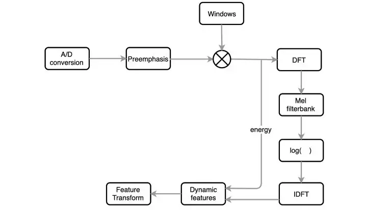
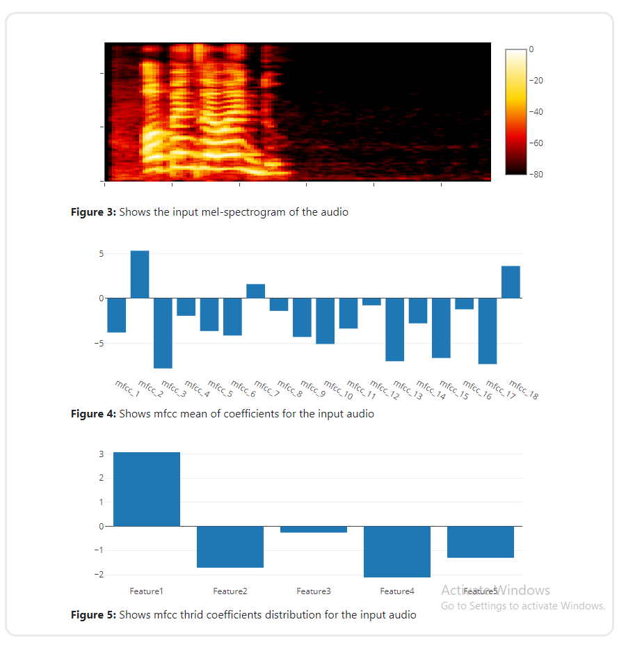
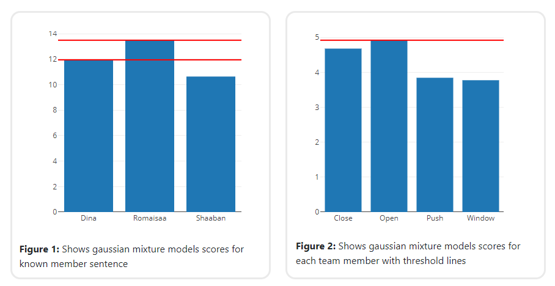
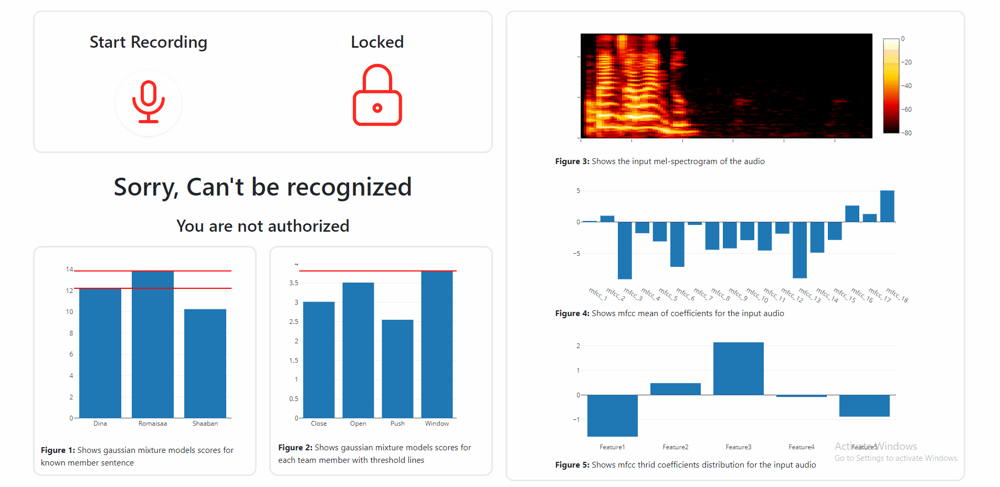

# Voice-Passsword-Checker || DSP Task 3

## Table of contents:

- [Introduction](#introduction)
- [Work Process](#work-process)
- [Project Features](#project-features)
- [Project full Demo](#project-full-demo)
- [Project Structure](#project-structure)
- [How to Run The Project](#run-the-project)
- [Team]()

### Introduction

Voice Password checker is a web application used for Voice authentication (voice biometrics voice ID or speaker recognition). The system is speech dependent which requires authorized person with correct sentence said. In our appplication, Team Members are only authorized with "Open the door" sentence.

### Work Process

- Voice Feature Extraction depending on MFCCs:



- Models Training for user and sentence identification

- Model Deployment using web technologies (Flask, Html, CSS, JS)

### Project Features

In this web application you can

> 1. Easily use recorder to check
>    

> 2. Live Visulaization for input audio features
>    

> 3. Models Scores of input audio (User and Sentence)
>    

### Project full Demo



### Project Structure

The Web Application is built using:

- Frontend:
  - HTML
  - CSS
  - JavaScript
  - Ajax
- Backend framework:
  - Flask (Python)

The Frontend main function to set the structure of the page and plot the signals and mange
the user interface while the backend function is to do on-signal operations like sampling,
reconstructing, adding signal, adding noise & removing signal.

```
main
├─ Notebooks
├─Training sets
├─ static (JS & CSS files)
│  ├─  css
│  ├─  img
│  └─  js
├─ template (HTML files)
├─ app.py (Back-End Server)
├─ Gmm.py (Audio preprocessing and Models Predictions)
├─ utilities.py (Data to draw helpers)
└─ README.md
```

### Run the Project

1. Install Python3 in your computer

```
Download it from www.python.org/downloads/
```

2. Install the following packages
   - numpy
   - flask
   - flask_cors
   - Librosa
   - pickle
   - scipy
   - sklearn
   - python_speech_features

- Open Project Terminal & Run

```
pip install -r requirments.txt
```

3. Start Server by Running

```
python app.py
```

4. Visit http://127.0.0.1:5001

### Team

First Semester - Biomedical Digital Signal Processing (SBE3110) class project created by:

| Team Members' Names                                  | Section | B.N. |
| ---------------------------------------------------- | :-----: | :--: |
| [Dina Hussam](https://github.com/Dinahussam)         |    1    |  28  |
| [Romaisaa Shrief](https://github.com/Romaisaa)       |    1    |  36  |
| [Youssef Shaaban](https://github.com/youssef-shaban) |    2    |  56  |

### Submitted to:

- Dr. Tamer Basha & Eng. Abdullah Darwish
  All rights reserved © 2022 to Team 14 - Systems & Biomedical Engineering, Cairo University (Class 2024)
